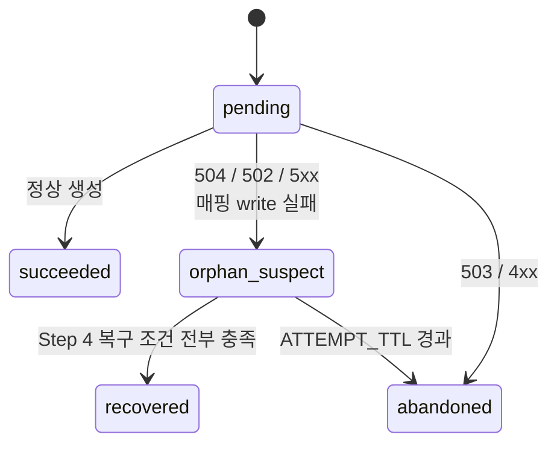
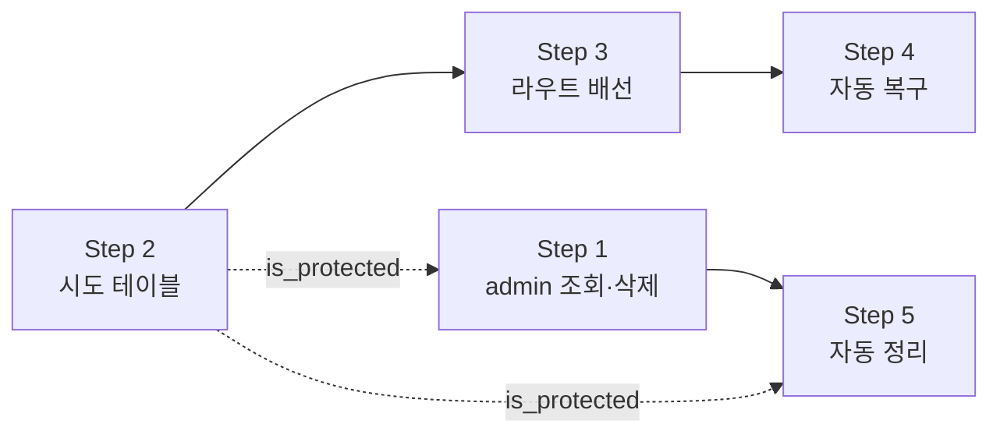

# 고아 Knowledge Base 대응 계획

PR #84 리뷰 후속 · 작성일 2026-09-21

## 요약

게이트웨이가 타임아웃으로 먼저 끊긴 뒤 MLOps가 KB 생성을 완료하면, 게이트웨이에 매핑이 남지 않아 **조회도 삭제도 불가능한 고아 KB**가 된다. 실측 결과 이미 **37건**이 그 상태다.

대응은 A안(요청 전 기록 + 사후 매칭)으로 진행한다. 업스트림이 소유자 정보를 전혀 보관하지 않아 이름만으로는 매칭이 불가능하지만, **스냅샷 델타 + KB명 + 업로드 파일명**을 조합하면 사람 개입 없이 안전하게 판정할 수 있다. 두 경로를 병행한다.

- **자동 복구** — 조건을 전부 만족하면 매핑을 자동 생성한다. 하나라도 어긋나면 아무것도 하지 않는다.
- **자동 정리** — 복구되지 않은 고아는 유예기간 후 업스트림에서 삭제해 자원을 회수한다.

관리자 화면은 자동화의 관측·수동 개입 창구로만 둔다.

## 1. 배경과 범위

PR #84 리뷰에서 후속 이슈 2건이 제기되었다.

| | 내용 | 담당 |
|---|---|---|
| 이슈 1 | `httpx` 전송 오류가 전부 500으로 매핑되는 문제 | 별도 담당자 |
| 이슈 2 | 타임아웃 후 발생하는 고아 KB | **이 문서** |

이 문서는 이슈 2만 다룬다. 이슈 1과의 작업 충돌 관리는 5장 Step 0에 포함했다.

한 가지 정정: 최초 제안서에 `httpx.ConnectError`를 502로 적었으나, 코드 선례는 **503**이다. `any_cloud_service.py`는 `ConnectError → 503`, `RequestError → 502`, `TimeoutException → 504`의 3단 구조를 쓴다. 이슈 1 담당자에게 전달이 필요하다.

## 2. 문제 정의

### 게이트웨이 매핑 테이블의 역할

게이트웨이는 KB 내용을 보관하지 않는다. 문서·청크·임베딩·Milvus 컬렉션은 전부 MLOps에 있고, 게이트웨이 `knowledge_bases` 테이블은 색인 카드 한 장에 해당한다.

```
id=12 | surro_knowledge_id=407 | name="사내규정_2026" | created_by="kim.dev" | collection_name=...
```

`surro_knowledge_id`가 MLOps 쪽 실제 KB 번호다. **이 카드가 없으면 KB가 서고에 있어도 게이트웨이는 그 존재를 모른다.**

### 고아가 생기는 과정

| 시각 | 게이트웨이 | MLOps |
|---|---|---|
| 0:00 | `routes/knowledge_base.py:446` → POST (타임아웃 600초) | 파일 수신, 청킹 시작 |
| 0:00~ | 응답 대기 | GPU 콜드스타트로 임베딩 지연 |
| 10:00 | 600초 초과 → `ReadTimeout` → **504 반환** | 계속 처리 중 |
| 10:00 | 예외가 446행에서 그대로 올라가 **462행(카드 저장)이 실행되지 않음** | |
| 13:20 | (아무 일 없음) | **KB 407 커밋, Milvus 컬렉션 생성** |

13:20 시점에 MLOps에는 정상 KB가 있고 게이트웨이에는 행이 없다. 결정적으로 게이트웨이는 `407`이라는 번호를 **한 번도 본 적이 없다.** 그 값은 받지 못한 응답 본문에만 있었다.

> 이 타임라인의 `13:20`(시작 후 3시간 20분)은 설명용 가정값이다. 콜드스타트 실측치가 없어
> 임의로 잡았다. Step 4의 `MAX_INGEST` 가 이 지연을 덮지 못하면 이 시나리오 자체가 복구되지
> 않으므로, **`MAX_INGEST` 값이 정해지면 이 예시도 그 값에 맞춰 다시 써야 한다.**
> 7장 3번 항목이 이 파라미터를 다룬다.

발생 경로는 타임아웃 하나가 아니다.

1. 타임아웃 (위 시나리오)
2. 매핑 write 실패 — `routes/knowledge_base.py:475-479`가 "created in external API but failed to save"로 이미 인정하고 있다
3. 응답 반환 전 워커 재시작 또는 클라이언트 절단
4. 사람이 게이트웨이 DB를 직접 수정 (3장에서 실제 사례 확인)

### 왜 영구적인가

후속 오퍼레이션 6개가 전부 매핑 행 존재를 선행 조건으로 요구한다.

| 오퍼레이션 | 404 발생 지점 |
|---|---|
| 상세조회 | `routes/knowledge_base.py:604` |
| 수정 | `:653` |
| 삭제 | `:727` |
| 파일추가 | `:778` |
| 검색 | `:874` |
| 검색기록 | `:903` |

목록 조회는 로컬 주도이므로 고아가 아예 노출되지 않는다. MLOps 목록도 호출하지만 `chunk_size` 등을 채우는 용도일 뿐이다.

**관리자도 처리할 수 없다.** `admin`은 소유자 검사만 우회하고, 그 앞줄의 카드 존재 검사는 role과 무관하게 걸린다. 목록 라우트도 role과 상관없이 `member_id`로 필터하므로 관리자가 고아의 ID를 발견할 경로 자체가 없다.

결과적으로 Milvus 컬렉션과 오브젝트 스토리지, 이미 소모한 임베딩 연산이 회수 불가능한 상태로 점유된다. 사용자가 재시도하면 동일 문서로 두 번째 컬렉션이 생긴다.

### create에만 이 문제가 있는 이유

create와 delete는 **동일하게 "외부 먼저, 로컬 나중"** 순서인데 결과가 반대다.

| | 외부 성공 + 로컬 실패 시 상태 | 재시도하면 |
|---|---|---|
| create | 카드 없음 → 접근 불가 | 새 KB만 생기고 원본은 영구 고아 — **수렴하지 않음** |
| delete | 카드 남음 → 접근 가능 | 업스트림 404 → 서비스가 `False` 반환 → 로컬 정리 — **수렴함** |

## 3. 현황 실측

업스트림 API와 게이트웨이 DB를 직접 대조해 확인했다. 업스트림에는 읽기 전용 GET만 호출했다.

### 3.1 업스트림은 소유자를 보관하지 않는다

전체 51건의 `created_by`, `updated_by`, `deleted_by`가 **모두 빈 문자열**이다. 필드는 응답에 존재하지만 값이 채워지지 않는다.

결정적 증거는 게이트웨이가 소유자를 아는 건들과의 대조다. 아래 4건은 **서로 다른 사용자가 게이트웨이를 통해** 생성했고, 게이트웨이는 생성 시 `X-User-ID` 헤더를 실어 보냈다.

| surro_id | 게이트웨이 DB `created_by` | 업스트림 `created_by` |
|---|---|---|
| 30 | `test-user` | `''` |
| 46 | `user1` | `''` |
| 52 | `pol-user` | `''` |
| 66 | `pol-user` | `''` |

**MLOps는 X-User-ID를 소유자로 저장하지 않는다.** A안의 소유자 귀속 신호가 존재하지 않는다는 뜻이다.

### 3.2 업스트림 목록은 X-User-ID로 필터하지 않는다

```
X-User-ID 없음              -> 51건
X-User-ID=seo202509         -> 51건
X-User-ID=존재하지않는유저     -> 51건
```

절반은 유리한 조건이다. 서비스 계정으로 전체 목록을 볼 수 있으므로 델타 계산이 가능하다. 나머지 절반은 불리하다. **업스트림에 소유자 개념이 없고, 게이트웨이 DB가 유일한 접근 통제다.**

### 3.3 고아 37건이 이미 존재한다

```
업스트림 KB            : 51
게이트웨이 active 매핑 : 14
게이트웨이 접근 불가   : 37
```

전부 타임아웃 고아는 아니다. 게이트웨이를 거치지 않은 직접 호출과 아래 3.5의 수동 DB 수정 건이 섞여 있다. 어느 쪽이든 현재 게이트웨이로는 조회도 삭제도 불가능하다.

### 3.4 쓸 수 있는 상관 신호는 파일명이다

먼저 쓸 수 없는 것부터.

- `collection_name` = `kb_6285886c80d5475e` — **랜덤 hex**. 이름에서 유도되지 않아 게이트웨이가 예측할 수 없다.
- `name` — 20종 중 유일한 이름이 10종뿐이다. `test` 11건, `knowledge-test` 8건, `testknowledge` 5건, `test-test` 5건. 이름 매칭은 단독으로 쓸 수 없다.

반면 **KB 상세 응답은 업로드 파일명을 돌려준다.**

```
id=66 name=ask-doc  files=1 -> [('명함 신청 fb7613cd0bbb432fa6e57924eef29a14.pdf', 2)]
id=62 name=test     files=1 -> [('kb-test-sample.csv', 10)]
```

게이트웨이는 생성 시점에 `file.filename` 을 이미 갖고 있으므로, 이 값을 시도 레코드에 저장해두면
**KB명 + 파일명** 두 축으로 대조할 수 있다. 실사용 문서의 파일명은 KB명보다 변별력이 훨씬 높다.
위 예시의 `test` / `kb-test-sample.csv` 반복은 개발 테스트 데이터의 특성이다.

### 3.5 삭제 누수는 반증되었다

당초 "게이트웨이에서 삭제했는데 업스트림에 남은 건"이 의심되어 별도 확인했으나, 세 번째 이슈는 아니었다.

| `deleted_by` | 건수 | 업스트림 잔존 |
|---|---|---|
| `admin` (실제 계정) | 6 | **0건** |
| `system:cleanup` | 1 | 0건 |
| `system-sync` | 3 | 3건 |

사용자가 삭제한 6건은 전부 업스트림에서도 사라졌다. **삭제 전파는 정상 동작한다.**

업스트림에 남은 3건은 `system-sync`가 지운 것인데, 이 식별자는 **현재 코드에도 git 전체 이력에도 존재하지 않는다.** 현재 코드의 시스템 행위자는 `system:upstream-id-reused`(`cruds/knowledge_base.py:34`)와 `system:workflow-reconcile`(`scheduler.py:168`) 둘뿐이다. 게다가 3건의 `deleted_at`이 마이크로초까지 동일하다.

```
surro=11 test-inno   deleted_at=2026-04-13 07:33:48.188608+00:00
surro=12 string      deleted_at=2026-04-13 07:33:48.188608+00:00
surro=13 ttest       deleted_at=2026-04-13 07:33:48.188608+00:00
```

요청 단위로 도는 코드는 이런 타임스탬프를 만들지 않는다. 과거에 DB를 직접 일괄 UPDATE한 흔적이며, 코드 결함이 아니다.

부수 확인 2건:

- 업스트림 목록 51건 전부 `deleted_at=null` — 업스트림 DELETE는 목록에서 확실히 제거한다. soft-delete 잔재가 델타 계산을 오염시킬 우려는 없다.
- `deleted_at` / `is_active` 불일치 0건 — 이 정합성이 깨지면 유니크 부분 인덱스는 점유하는데 조회에는 안 잡혀 해당 surro_id로 새 매핑을 만들 수 없는 교착이 생긴다. 현재는 정상이다.

## 4. 방안 검토

### B안 배제

접수 즉시 응답 + 상태 폴링 방식은 고아 발생 가능성을 구조적으로 제거하지만, MLOps 측 API 변경이 필요하다. 외부 기관 협의 사안이라 이번 범위에서 제외했다.

### A안 채택

A안은 요청 전 시도 기록을 남기고 나중에 업스트림 목록과 대조해 매핑을 완성하는 방식이다. 게이트웨이 단독으로 가능하다는 점에서 유일한 선택지다.

`created_by` 가 비어 있어 소유자를 업스트림에서 읽을 수는 없다. 대신 **시도 레코드의 인증된 요청자**가 소유자이고, 남은 문제는 "이 고아가 그 시도의 결과가 맞는가" 하나로 좁혀진다.

### 후보를 오염시킬 수 있는 것은 셋뿐이다

고아 집합은 `업스트림 목록 − 게이트웨이 active 매핑` 이다. 여기에 들어올 수 있는 것을 전수로 따지면:

| 오염원 | 게이트웨이가 아는가 | 처리 |
|---|---|---|
| 다른 사용자의 **성공한** 생성 | 매핑이 있다 | **고아 집합에서 자동 제외** |
| 다른 사용자의 **실패한** 시도 | 시도 레코드가 있다 | 유일성 조건으로 검출 → 자동화 중단 |
| **게이트웨이를 거치지 않은** 직접 생성 | 모른다 | **유일한 사각지대** |

성공한 생성은 매핑을 갖고 있어 애초에 후보가 되지 않는다. 실패한 다른 시도는 게이트웨이가
기록을 갖고 있어 검출 가능하다. 남는 것은 직접 생성뿐이고, 이는 "창 안에 게이트웨이가 설명하지
못하는 KB 가 하나라도 더 있으면 자동화를 중단" 하는 조건으로 **조용한 오매칭이 아니라 검출 가능한
거부**로 바꿀 수 있다.

### 병행 구조

| | 목적 | 사람 개입 |
|---|---|---|
| **자동 복구** | 조건 충족 시 매핑 생성 → 사용자가 KB를 되찾음 | 없음 |
| **자동 정리** | 복구되지 않은 고아를 유예기간 후 삭제 → 자원 회수 | 없음 |

자동 복구가 못 잡은 건은 자동 정리가 회수한다. 두 경로 모두 관리자 판단을 요구하지 않으며,
관리자 화면(Step 1)은 관측과 수동 개입용으로만 남는다.

### 오매칭의 실제 위험도

제안서는 이 위험을 "소유자 오배정"으로 적었으나, 실제 영향은 그보다 크다.

`knowledge_bases.created_by`는 **게이트웨이 측 유일한 권한 근거**다. 6개 라우트가 동일한 2줄로만 판정한다.

```python
if current_user.role != "admin" and existing_kb.created_by != current_user.member_id:
    raise HTTPException(status_code=403, detail="Permission denied")
```

KB는 RAG 말뭉치이므로, 소유자를 잘못 기록하면 `POST /{id}/search` 한 번으로 타인의 문서 원문 청크가 반환된다. 3.2에서 확인했듯 업스트림에는 소유자 개념이 없어 2차 방어선도 없다.

따라서 수용 기준은 "오매칭 확률이 낮으니 감수한다"가 아니라 **"오매칭 0, 미매칭은 허용"**(fail-closed)이어야 한다.

## 5. 구현 계획

### Step 0 — 이슈 1과의 충돌 경계 (착수 전 합의)

| 파일 | 소유 |
|---|---|
| `app/services/knowledge_base_service.py` | **이슈 1** — 이슈 2는 수정하지 않음 |
| `app/routes/knowledge_base.py` | **이슈 2** |
| 신규 model / crud / schema / migration | 이슈 2 |

이슈 2는 서비스 레이어를 건드리지 않고 라우트에서 `HTTPException.status_code`만 보고 분류한다. 이슈 1이 503/502/504를 세팅하면 이슈 2의 분류가 자동으로 정확해지는 구조다.

`_raise_kb_timeout` 로그에 KB 이름과 member_id를 추가하는 건은 이슈 1 파일이므로 그쪽에 요청한다. 현재 이 함수가 남기는 로그는 `"Timeout: Knowledge base creation"` 한 줄뿐이라 어떤 요청이 끊겼는지 추적할 수 없다.

검증: 작업 후 `git diff --name-only` 교집합이 `app/routes/knowledge_base.py` 뿐일 것

### 공통 규칙 — 보호 대상 판정

고아를 삭제하는 경로가 둘이다. Step 1(관리자 수동)과 Step 5(자동 정리). **두 경로 모두 아래 판정을
거쳐야 한다.** 각자 구현하면 한쪽만 고쳐지는 사고가 나므로 CRUD 에 함수 하나로 두고 공유한다.

```
is_protected(kb) =
    살아 있는 시도 레코드가 이 고아를 후보로 삼을 수 있는가?
      = state == 'orphan_suspect'
        AND started_at + ATTEMPT_TTL > now                        (아직 지켜보는 중)
        AND kb.id ∉ 시도.upstream_snapshot                         (그 시도 이후에 생긴 KB)
        AND started_at ≤ kb.created_at ≤ started_at + MAX_INGEST   (복구 창 안)
```

`is_protected` 가 참이면 아직 고아가 아니라 **주인이 정해질 수 있는 KB** 다. 업스트림에 뒤늦게
커밋됐지만 사용자가 아직 목록을 열지 않아 Step 4가 실행되지 않은 상태가 여기 해당한다.

**보호 범위는 복구 범위와 일치해야 한다.** 세 번째 줄(복구 창)이 그것을 맞춘다. 이 조건이 없으면
Step 4가 절대 복구할 수 없는 KB — 시도 한참 뒤에 생긴 무관한 KB — 를 `ATTEMPT_TTL` 동안 붙잡아
관리자 삭제를 막는다. 막히는데 복구도 안 되는 구간이 생기는 것이다. `created_at` 은 업스트림 목록
응답에 이미 들어 있으므로 이 조건에 추가 호출 비용이 없다.

**대신 `name` 과 `filename` 은 일부러 보지 않는다.** 파일명 대조는 KB 상세 조회가 필요해서 목록
API 가 항목마다 호출하면 N+1 이 된다. 이만큼은 느슨한 쪽이 안전 방향이기도 하다 — 과보호는
생겨도 과삭제는 생기지 않고, 대가는 `ATTEMPT_TTL` 동안 삭제가 미뤄지는 것뿐이다.
**구현 시 비용이 드는 조건을 더 얹지 말 것.**

TTL 두 개의 관계를 불변식으로 고정한다.

```
ATTEMPT_TTL  <  PROXY_KB_ORPHAN_TTL
```

시도가 `abandoned` 로 포기된 뒤에야 정리가 손을 댄다. 이 순서가 뒤집히면 복구 가능한 KB 가
복구 기회를 얻기 전에 삭제된다. 설정값 검증에 이 부등식을 넣는다.

### Step 1 — 관리자 고아 조회·삭제 (선행 가능, 즉시 값)

```
GET    /api/v1/knowledge-bases/admin/orphans
DELETE /api/v1/knowledge-bases/admin/orphans/{surro_id}
```

- 고아 = 업스트림 목록 − 게이트웨이 active 매핑. **요청 시 실시간 대조** (스케줄러 미사용)
- `Depends(get_current_admin_user)` (`app/auth.py:128`)
- 감사로그 `Action.DELETE` / `ResourceType.KNOWLEDGE_BASE`
- 업스트림 목록이 비면 "전부 고아"로 해석하지 않고 거부 (`scheduler.py:162` 선례)
- DELETE는 active 매핑 부재를 재확인한 뒤에만 업스트림 삭제

**목록 응답은 `is_protected` 결과를 항목마다 함께 내보낸다.** 보호 대상은 `복구 대기` 로 표시하고,
어떤 시도 레코드가 지켜보고 있는지(요청자·시각)를 함께 보여준다. 표시가 없으면 관리자가 곧 주인이
정해질 KB 를 고아로 오인해 삭제한다.

**DELETE 는 `is_protected` 가 참이면 409 로 거부한다.** 관리자가 그래도 지워야 한다면
`?force=true` 로 명시하게 하고, 이 경우 감사로그에 강제 삭제임을 남긴다. 기본값이 거부여야 하는
이유는 실수의 방향이 비대칭이기 때문이다 — 안 지워서 생기는 손해는 자원 점유 며칠이고, 지워서
생기는 손해는 사용자가 10분 넘게 기다려 만든 KB 의 소실이다.

강제 삭제가 성공하면 그 KB 를 보호하던 시도 레코드를 즉시 `abandoned` 로 내린다. 그대로 두면
붙을 대상이 없는 시도가 `ATTEMPT_TTL` 동안 남아 무관한 고아를 계속 보호한다.

검증: 현재 37건 노출 / active 14건 미노출 / 매핑 있는 id로 DELETE 시 거부 /
보호 대상 DELETE 시 409, `force=true` 시 삭제 + 감사로그 + 해당 시도 `abandoned` /
**복구 창 밖에 생긴 KB 는 살아 있는 시도가 있어도 보호되지 않고 삭제 가능**

### Step 2 — 시도 레코드 테이블

`knowledge_base_create_attempts`

| 컬럼 | 용도 |
|---|---|
| `member_id` | 인증된 요청자 (소유자의 유일한 신뢰 근거) |
| `name` | 요청한 KB 이름 |
| `filename` | 업로드 파일명 — 업스트림 `files[].name` 과 대조하는 2차 축 |
| `request_id` | access.log 상관 추적 |
| `upstream_snapshot` | POST 직전 업스트림 KB id 집합. 컬럼 타입은 portable 한 `JSON` — 테스트가 sqlite 인메모리라 `JSONB` 는 쓰지 않는다. 획득 실패 시 `null` |
| `state` | 아래 상태도 참조 |
| `failure_kind` | 실패 분류 |
| `started_at`, `finished_at` | 시도 창 |
| `resolved_surro_id` | 확정된 KB 번호 |
| `recovered_at` | 자동 복구로 매핑이 붙은 시각. 정상 생성이면 `null`. 복구율 지표·사후 추적용이며 응답에는 노출하지 않는다 |

상태 전이:



**`orphan_suspect` 이면서 TTL 이내인 행만 보호 효력을 갖는다.** 공통 규칙의 `is_protected` 가
보는 대상이 이것이다.

**보존 정책** — `succeeded` 는 Step 4 의 조건 6(중복 재시도 검출)이 읽으므로 **`ATTEMPT_TTL`
보다 반드시 길게** 보관한다. 이보다 짧게 잡으면 재시도 성공 기록이 먼저 사라져 중복 판정이
무력화되고, 구분할 수 없는 KB 두 개가 사용자 목록에 남는다. `recovered` 와 `abandoned` 는 사후
추적용으로 더 길게 보관한다. 정책이 없으면 테이블이 무한히 자란다.

마이그레이션 `down_revision` = `e60718293a4b` (현재 head)

검증: `alembic upgrade head` 후 `alembic heads` 단일 유지 /
`ATTEMPT_TTL < PROXY_KB_ORPHAN_TTL` 설정 검증이 위반 시 기동을 막는지

### Step 3 — create 라우트 배선

`routes/knowledge_base.py:446` 앞에 스냅샷 + 시도 레코드 commit, 446행을 try로 감싸 분류한다.

| 결과 | state |
|---|---|
| 성공 | `succeeded` + `resolved_surro_id` |
| 504 타임아웃 / 502 / 업스트림 5xx | `orphan_suspect` |
| 503 연결 실패 / 4xx | `abandoned` |
| 매핑 write 실패 (`:475-479`) | `orphan_suspect` |

**시도 레코드는 생성도 상태 갱신도 별도 세션(`SessionLocal()`)으로 커밋한다.** 라우트의 `db`
세션을 쓰면 매핑 write 실패 시 롤백에 휩쓸려, 정작 기록이 필요한 순간에 행이 사라진다. 생성만
분리하고 갱신을 라우트 세션에 두면 `orphan_suspect` 로 바꾸는 그 write 가 함께 날아가므로,
양쪽 다 분리해야 의미가 있다.

순서도 중요하다. 시도 레코드를 MLOps 호출 **전에** 쓰므로, 이 쓰기가 실패하면 MLOps를 호출하지 않고 종료된다. 외부 부작용 없이 실패한다.

**스냅샷 획득 실패 시** — POST 직전 업스트림 목록 호출이 실패하면 `upstream_snapshot` 을 `null`
로 두고 **생성은 그대로 진행한다.** 업스트림 일시 장애가 KB 생성 전체를 막는 편이 더 나쁘기
때문이다. 대신 스냅샷이 없으면 Step 4의 조건 2를 계산할 수 없으므로 그 시도는 자동 복구 대상에서
제외되고, `is_protected` 도 성립하지 않는다. 즉 **평소보다 나빠지지 않고, 개선분만 포기**하는
동작이다.

검증: 타임아웃·매핑실패 주입 테스트로 state 확인 / 매핑 실패 후에도 시도 레코드 생존 확인 /
스냅샷 실패 주입 시 생성 성공 + `upstream_snapshot is null`

### Step 4 — 자동 복구

**실행 위치는 목록 조회 라우트다.** 별도 스케줄러를 쓰지 않는다. `get_knowledge_bases` 는 이미
매 요청마다 업스트림 전체 목록을 받아 `external_kb_map` 을 만들고 있으므로, 델타 계산에 필요한
데이터가 그 자리에 이미 있다. 호출자 본인의 `orphan_suspect` 시도만 해소를 시도한다.

타임아웃을 겪은 사용자는 곧 목록을 새로고침한다. 복구가 필요한 바로 그 시점에, 추가 비용 없이
동작한다. 업스트림이 아직 처리 중이면 아무 일도 일어나지 않고 다음 조회에서 다시 시도한다.

자동 매핑 조건 — **전부 만족할 때만** 매핑을 생성한다:

0. `T.upstream_snapshot` 이 `null` 이 아님 (스냅샷 획득 실패 시도는 대상 제외)
1. 시도 `T.state == orphan_suspect` 이고 `ATTEMPT_TTL` 이내
2. **창 안에 나타난 미지의 KB 가 정확히 1개**
   - 미지 = `업스트림 현재 목록` − `T.upstream_snapshot` − `게이트웨이 전체 매핑`
   - 창 = `T.started_at` ≤ 업스트림 `created_at` ≤ `T.started_at + MAX_INGEST`
   - **`게이트웨이 전체 매핑` 은 soft-delete 된 행까지 포함한다.** 게이트웨이가 한 번이라도
     알았던 KB 는 "미지" 가 아니다. active 만으로 해석하면 사용자가 지운 KB 가 다시 미지로
     올라와 개수를 부풀리고, 멀쩡한 복구를 거부시킨다.
3. 그 KB 의 `name == T.name` (완전 일치)
4. 그 KB 의 `files[].name == T.filename` (완전 일치)
5. 그 KB 를 창에 포함하는 `orphan_suspect` 시도가 `T` 하나뿐
6. **사용자가 이미 같은 것을 갖고 있지 않음** — `T.member_id` 가 `T` 이후에 같은 `name` + 같은
   `filename` 으로 성공시킨 시도가 있고, 그 시도의 `resolved_surro_id` 에 대한 **active 매핑이
   지금도 살아 있으면** 복구하지 않는다

하나라도 어긋나면 **아무것도 하지 않는다.** 시도는 `orphan_suspect` 로 남고 Step 5의 정리 대상이
된다. 소유자는 `T.member_id` 로 고정되며 어디서도 추론하지 않는다.

2번이 사각지대를 닫는 지점이다. 게이트웨이를 거치지 않은 직접 생성이 창 안에 끼면 미지의 KB 가
2개 이상이 되어 자동화가 스스로 멈춘다. 조용한 오매칭 대신 검출 가능한 거부가 된다.

**창에 상한(`MAX_INGEST`)을 두는 이유가 여기 있다.** 상한이 없으면 창이 조회 시점까지 계속
열려 있어, 사용자가 늦게 볼수록 무관한 KB 가 끼어들 확률이 올라간다. 그러면 복구 기회를 주려고
`ATTEMPT_TTL` 을 늘릴수록 복구율이 **떨어지는** 역설이 생긴다. 상한을 두면 창 크기가 조회 시점과
무관하게 고정되고, 두 파라미터가 서로 간섭하지 않는다. `MAX_INGEST` 는
`PROXY_KB_INGEST_TIMEOUT`(600초)에 업스트림이 타임아웃 이후 처리를 마칠 여유를 더한 값으로 잡는다.

4번 조건 때문에 후보 KB 의 상세 조회가 1회 추가된다. 후보가 좁혀졌을 때만 호출하므로, 복구할
것이 없는 평시에는 **시도 테이블 조회 1회**로 끝난다. 업스트림이 KB 를 커밋했지만 `files[]` 가
아직 비어 있는 순간이 있을 수 있는데, 이때는 조건 4가 실패해 복구가 미뤄지고 다음 목록 조회에서
다시 시도된다. 자가 치유되므로 별도 처리는 두지 않는다.

**복구 로직은 목록 조회를 실패시키면 안 된다.** 전체를 `try/except` 로 감싸고 실패 시 로그만
남긴다. 부가 기능이 주 기능을 깨면 사용자가 KB 목록 자체를 못 본다.
[dataset.py:369-381](../app/routes/dataset.py#L369-L381) 의 `backfill_cache_if_changed` 가 같은
상황에 같은 패턴을 쓰고 있다.

**6번이 프론트 의존을 없앤다.** 504 를 받은 사용자의 가장 흔한 다음 행동은 즉시 재시도이고,
그러면 같은 이름·같은 파일의 KB 가 두 개가 된다. 원본이 뒤늦게 복구되면 사용자 목록에 구분할 수
없는 항목 두 개가 나란히 놓인다. 어느 쪽이 뒤늦게 돌아온 것인지 화면에 표시하려면 `ai-paas-web`
작업이 필요해진다.

6번은 표시하는 대신 **그 상황을 만들지 않는다.** 조건에 걸리는 건은 사용자가 이미 같은 내용의
쓸 수 있는 KB 를 쥐고 있는 경우이므로, 원본을 되살리지 않고 Step 5 에 넘겨도 실질 손해가 없다.
**검출되는 경우와 구분이 불가능한 경우가 정확히 겹친다**는 점이 이 조건의 근거다.

| 사용자의 재시도 | 조건 6 | 결과 |
|---|---|---|
| 같은 이름 · 같은 파일 | 걸림 | 미복구 → Step 5 가 회수. 애초에 구분 불가능했던 케이스 |
| 다른 이름으로 재생성 | 안 걸림 | 정상 복구. 이름이 달라 사용자가 눈으로 구분 가능 |
| 재시도도 타임아웃 | 조건 5 에서 이미 걸림 | 양쪽 다 미복구 |
| 재시도 후 그것을 삭제 | 안 걸림 (active 매핑이 없다) | 정상 복구. 중복이 아니다 |

조건 5 가 **실패한 시도끼리의** 경합을 막고, 조건 6 이 **성공한 시도와의** 경합을 막는다. 판정에
필요한 데이터가 시도 테이블과 로컬 매핑에 전부 있어 **업스트림 추가 호출이 없다.**

`recovered_at` 은 기록하되 응답에 노출하지 않는다. 복구율 지표와 사후 추적용이다.

**남는 위험:** 사용자의 시도 창 안에 누군가 게이트웨이를 우회해 **같은 KB명 + 같은 파일명**으로
KB 를 정확히 하나 만들고, 정작 사용자 본인 KB 는 끝내 생성되지 않는 경우. 사고로는 일어나기
어렵다. 고의라면 실익이 없다 — 3.2에서 확인했듯 MLOps 에 직접 접근 가능한 주체는 이미 전체 KB 를
조회·검색할 수 있다.

**surro_id 재사용 시 동작** — 업스트림이 삭제된 KB 의 번호를 재사용하는 현상이 이 시스템에서
관측된 적이 있다. [cruds/knowledge_base.py:34](../app/cruds/knowledge_base.py#L34) 의
`system:upstream-id-reused` 가 그 방어 코드다. 실측에서도 게이트웨이 행이 업스트림 KB 보다 8개월
앞서는 건이 3건 나왔다(surro 11·12·13). 재사용된 번호는 시도 시점의 스냅샷에 이미 들어 있으므로
조건 2에서 후보에서 빠진다. 결과는 **미복구**이고, 오매칭은 일어나지 않는다. 안전한 방향이므로
별도 처리를 두지 않는다. 구현 중 "왜 복구가 안 되지" 로 보이더라도 조건을 풀지 말 것.

검증: 단일 후보 자동 복구 후 목록 노출 / 창 안 미지 KB 2개 주입 시 미복구 / 파일명 불일치 시
미복구 / 스냅샷에 이미 있던 id 는 후보에서 제외 / **`created_at` 이 `MAX_INGEST` 를 벗어난 KB 는
후보에서 제외** / 동명 시도 2건 주입 시 미복구 /
**같은 name+filename 으로 성공한 재시도가 active 면 미복구, 그 재시도를 삭제하면 복구됨** /
**복구 로직이 예외를 던져도 목록 조회는 200**

### Step 5 — 자동 정리

복구되지 않은 고아를 유예기간 후 업스트림에서 삭제해 자원을 회수한다. 소유자를 판정하지 않으므로
오배정 위험이 원천적으로 없다.

- 대상: 게이트웨이 active 매핑이 없고, 업스트림 `created_at` 이 `PROXY_KB_ORPHAN_TTL` 이전이며,
  **공통 규칙의 `is_protected` 가 거짓인** KB
- 업스트림 목록이 비면 중단 (`scheduler.py:162` 선례)
- 삭제 전 감사로그 기록, actor `system:kb-orphan-cleanup`
- **dry-run 모드를 기본값으로 두고**, 대상 목록만 로그에 남긴 뒤 운영 확인을 거쳐 실삭제를 켠다

**이 단계만은 주기 실행이 필요하다.** 목록 조회에 얹을 수 없다 — 정리 대상은 정의상 아무도
조회하지 않는 KB 이기 때문이다. `ENABLE_SCHEDULER` 는 기본 false 이고 in-process 단일 워커
가정이므로, 운영에서는 별도 프로세스나 외부 cron 으로 돌리는 편이 낫다. 실행 주체는 운영 배포
방식에 맞춰 정한다.

검증: dry-run 이 TTL 경과 고아만 집계 / active 매핑 있는 id 는 대상에서 제외 /
**`is_protected` 참인 id 는 대상에서 제외** / 업스트림 빈 응답 시 중단 / 실삭제 후 업스트림에서 소멸

### Step 6 — Swagger 문구 수정

`routes/knowledge_base.py:167-168`의 "목록에 없으면 관리자에게 확인 요청"을 실제 admin 경로 안내로 교체한다. 현재 문구는 사용자에게는 정확하지만, 관리자가 확인할 방법을 제공하지 않는다.

검증: `python scripts/gen_api_docs.py --check` 통과

### 단계 간 의존



**구현은 두 갈래, 런타임은 한 몸이다.** 이 구분이 중요하다.

- **Step 1 → 5** (삭제 갈래) — 고아 집합 계산 로직이 같아 Step 1이 Step 5의 선행이자 dry-run
  검증 수단이 된다. **기존 37건은 이 갈래로 처리된다.**
- **Step 2 → 3 → 4** (복구 갈래) — 순차 의존이며, 앞으로 발생하는 건의 자동 복구를 담당한다.
- **두 갈래는 같은 KB 를 두고 경합한다.** 삭제 갈래가 복구 갈래보다 먼저 손대면 복구 가능한 KB 가
  사라진다. 공통 규칙의 `is_protected` 와 `ATTEMPT_TTL < PROXY_KB_ORPHAN_TTL` 불변식이 이 경합을
  정리하는 유일한 장치다.

순서상 Step 1을 먼저 머지할 수 있지만, **그 시점에는 시도 테이블이 없어 `is_protected` 가 항상
거짓**이다. Step 1 단독 배포 구간에서는 보호 대상이 존재하지 않으므로 안전하다. Step 2가 들어오는
순간부터 Step 1이 `is_protected` 를 참조하도록 함께 배선해야 한다. **이 배선을 빠뜨리면 결함이
그대로 남는다.**

Step 6(Swagger)은 Step 1·4 문구가 확정된 뒤 마지막에 정리한다.

## 6. 결정 사항과 귀결

| 항목 | 결정 | 트레이드오프 |
|---|---|---|
| 복구 방식 | **조건부 자동, 사람 개입 없음** | 조건이 엄격해 복구율은 100%가 아니다. 못 잡은 건은 자동 정리로 회수 |
| 복구 실행 위치 | **목록 조회 시 지연 실행** | 스케줄러 불필요, 필요한 시점에 동작. 사용자가 목록을 안 보면 복구도 지연 |
| 정리 방식 | **TTL 경과 후 자동 삭제** | 자원이 확실히 회수된다. 주기 실행 주체가 필요하다 |
| 관리자 화면 | **관측·수동 개입 전용** | 판단을 요구하지 않는다. 자동화가 멈춘 건을 눈으로 확인하는 창구 |

### 귀결 1 — 기존 37건은 정리 갈래로만 처리된다

시도 레코드가 없으므로 Step 4의 조건 1번부터 성립하지 않는다. 3.5에서 확인했듯 그중 3건은 사람이
DB를 직접 수정한 흔적이고, 나머지도 대부분 게이트웨이를 거치지 않았거나 시도 기록 도입 이전
건이다. **자동 복구는 Step 3 배포 이후 발생분부터 적용된다.**

37건 중 보존이 필요한 건이 있다면 Step 5의 dry-run 목록을 보고 개별 판단으로 DB를 직접 처리한다.
자동 정리를 켜기 전에 이 확인을 한 번 거치는 것을 전제로 한다.

### 귀결 2 — 정리 단계에만 주기 실행 주체가 필요하다

복구는 목록 조회에 얹어 스케줄러를 피했지만, 정리는 그럴 수 없다. 정리 대상은 정의상 아무도
조회하지 않는 KB 이기 때문이다. `ENABLE_SCHEDULER` 기본값과 단일 워커 가정을 고려하면 별도
프로세스나 외부 cron 이 적절하다. 이 결정은 운영 배포 방식과 함께 정해야 한다.

### 귀결 3 — 복구 실패는 정상 동작이다

조건 중 하나라도 어긋나면 자동 복구는 아무것도 하지 않는다. 이는 장애가 아니라 설계된 거부다.
사용자 입장에서는 "KB가 안 보이니 다시 만든다" 가 되고, 원본은 Step 5가 회수한다. 복구율을
지표로 삼되 알람 대상으로 삼지 않는다.

**본인이 재시도해 성공한 경우는 거부가 오히려 정상 결과다.** 조건 6 이 이 건을 복구 대상에서
빼는 덕분에 사용자 목록에 구분 불가능한 중복이 놓이지 않고, 복구된 KB 를 화면에서 따로 표시할
필요도 사라진다. 이 문서에 프론트 의존 항목이 없는 이유가 여기 있다.

가장 흔한 실패 케이스는 **동시 타임아웃**이다. 사내 공통 문서는 KB명도 파일명도 겹치기 쉽다.

```
kim.dev  10:00 시도 "사내규정_2026" / "규정.pdf" → 타임아웃
park.dev 10:05 시도 "사내규정_2026" / "규정.pdf" → 타임아웃
13:20 KB 68 커밋, 13:50 KB 69 커밋
→ 두 시도 모두 창 안 미지 KB 가 2개 → 조건 2 위반 → 양쪽 다 미복구
```

드문 상황이 아니므로 복구율 목표를 세울 때 감안해야 한다. 이때도 오매칭은 일어나지 않고 두 건
모두 Step 5가 회수한다.

### 귀결 4 — 스냅샷이 없으면 개선분만 포기한다

업스트림 일시 장애로 스냅샷을 못 뜬 시도는 자동 복구 대상에서 빠지고 `is_protected` 도 성립하지
않는다. 즉 이 문서 도입 전과 같은 상태가 되며, 그보다 나빠지지는 않는다. 스냅샷 실패를 이유로
KB 생성을 거부하지 않는 이유가 여기 있다.

## 7. 리뷰 요청 사항

1. **Step 0의 파일 소유 경계**가 이슈 1 담당자와 합의 가능한지. 특히 `_raise_kb_timeout` 로그 보강을 이슈 1 쪽으로 넘기는 것.
2. **Step 4의 조건 2번(창 안 미지 KB 정확히 1개)이 과한지.** 이 조건을 빼면 복구율은 오르지만, 게이트웨이를 거치지 않은 직접 생성이 조용히 오매칭으로 이어지는 경로가 열린다. 복구율과 사각지대 사이의 선택이다.
3. **세 파라미터의 실제 값.** `ATTEMPT_TTL` 은 "사용자가 목록을 다시 열 때까지 기다려줄 기간", `PROXY_KB_ORPHAN_TTL` 은 "자원을 회수하기까지의 유예", `MAX_INGEST` 는 "업스트림이 타임아웃 이후에도 처리를 마칠 수 있는 최대 시간"이다. 불변식 `ATTEMPT_TTL < PROXY_KB_ORPHAN_TTL` 은 고정이다. `MAX_INGEST` 는 콜드스타트 실측치가 있으면 그에 맞춘다 — 없으면 보수적으로 크게 잡되, 창이 넓어질수록 조건 2가 거부될 확률이 올라간다.
4. **Step 5의 주기 실행 주체.** 별도 프로세스와 외부 cron 중 무엇으로 돌릴지. 운영 배포 방식과 함께 정해야 한다.
5. **Step 1의 `force=true` 강제 삭제를 열어둘지.** 기본값 409 거부는 확정이나, 우회 수단 자체를 둘지는 운영 판단이다. 열면 실수 경로가 생기고, 닫으면 TTL 만료까지 관리자가 손쓸 수 없는 KB 가 생긴다.
6. **기존 37건 dry-run 확인 주체.** 자동 정리를 켜기 전에 목록을 한 번 검토해야 하는데, 누가 볼지 정해지지 않았다.
7. **복구된 KB 의 목록 정렬.** 목록 기본 정렬은 게이트웨이 행 생성 시각(`created_at`, [knowledge_base.py:571](../app/routes/knowledge_base.py#L571)) 기준이라, 13:35 에 복구된 매핑이 실제로는 10:00 에 만들어진 KB 인데도 목록 맨 위에 올라온다. 복구 시 게이트웨이 `created_at` 을 업스트림 `created_at` 으로 맞추면 사실관계도 정확해지고 위치도 제자리로 가지만, 스키마 설명("Gateway 생성 시간")의 의미가 달라진다. 조건 6 이 중복 자체를 없앴으므로 혼동의 크기는 작다 — 넣을지는 판단 사항이다.
8. **범위 밖이지만 보고가 필요한 사항** — 3.2에서 확인된 대로 업스트림에 접근 통제가 없다. MLOps API에 직접 도달 가능한 주체는 서비스 계정 토큰 하나로 전체 KB를 조회·검색할 수 있다. 게이트웨이 매핑이 유일한 방벽이라는 점이 추정이 아니라 확인된 사실이 되었다.
